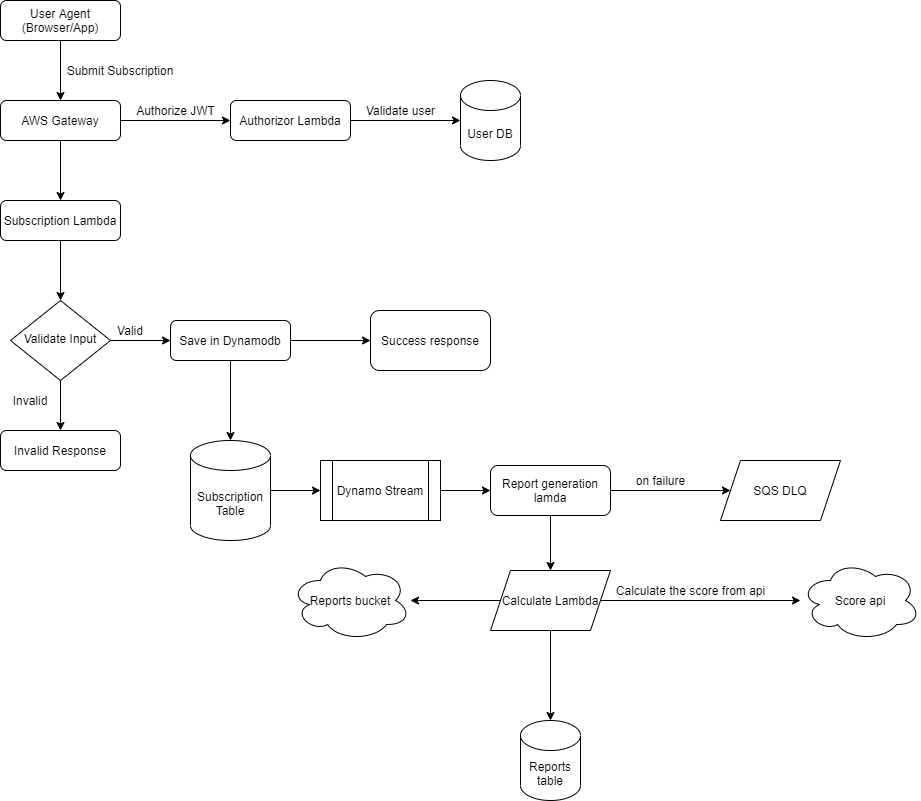

# High Level Plan

### Components

- AWS Lambda

  - It will be handle autoscaling on its own and will handle huge load easily

- API Gateway

  - It will allow us to deploy multiple endpoints and can add authorizor easily with serverless settings

- DynamoDB

  - It will allow us to save the data
  - It will give us the capability of dynamoStream which will give us to use Event-driven architecture
    - This will allow us to handle huge number of request within milliseconds

- S3

  - It will be used to save reports PDF if needed (Currently we have only final output)
    - TODO (Save PDF for the user)

- ReportLambda
  - It will calculate the report of the subscriptions
    - TODO
      - API for calculating score and updating the score
      - PDF save logic (if required)
      - SNS can be used if notification sending is required

### Flow Chart

