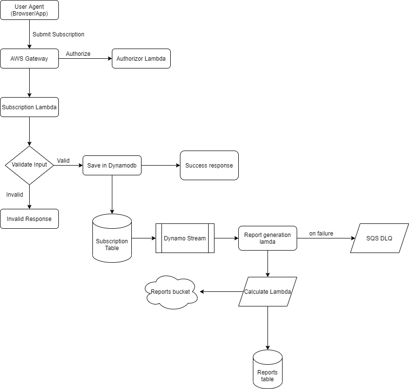

# System Design

## Flow Chart

## Detailed Design

### Components

- AWS Gateway

  - It will handle all the request coming into the server
  - It is attached with an authorizor which will validate the request

- Authorizor Lambda

  - It will validate Header from the request and allow the request to upstream if valid

- Subscription Lambda

  - It will validate the request body and save it in subscription table with email as the KEY

- Subscription Table

  - DynamoDB stream is activated on this table for NEW_AND_OLD_IMAGES
  - It will stream the data to another lambda as soon as an update is triggered.

- Dynamo Stream

  - It will stream the updated changes in the table

- Report generation lambda
  - It will read the stream and make the calculation required for the report
  - After calculation will save the final output in S3(For generating PDF) and will save the metadata key and result in reports table
  - If failed then the stream data will be sent to SQS-DLQ
